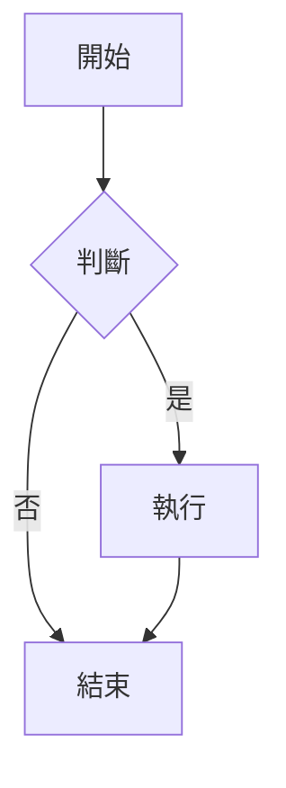

# mdPreview

A markdown preview tool deployed on GitHub Pages for online document preview and sharing.

一個功能完整的 Markdown 預覽工具，支援即時更新、Mermaid 圖表、KaTeX 數學公式及 PDF 匯出。

## 功能特色

- ✅ GitHub Flavored Markdown (GFM) 支援
- ✅ 程式碼語法高亮
- ✅ 表格、任務清單
- ✅ 自動產生目錄 (TOC)
- ✅ 亮色/暗色主題切換
- ✅ 檔案變更即時更新
- ✅ Mermaid 圖表渲染
- ✅ KaTeX 數學公式
- ✅ PDF 匯出
- ✅ Mermaid 圖表下載（SVG/PNG）

## 安裝

```bash
# 全域安裝
npm install -g .

# 或直接使用 node 執行
node bin/mdp.js <file.md>
```

## 使用方式

```bash
# 預覽 Markdown 檔案
mdp README.md

# 指定 port
mdp README.md --port 8080

# 不自動開啟瀏覽器
mdp README.md --no-open

# 顯示說明
mdp --help
```

## 範例

### 程式碼區塊

```javascript
function hello() {
  console.log('Hello, World!');
}
```

### 表格

| 功能 | 支援 |
|------|------|
| GFM | ✅ |
| Mermaid | ✅ |
| KaTeX | ✅ |

### 任務清單

- [x] 完成基本功能
- [x] 加入即時更新
- [x] 支援 Mermaid
- [x] 支援 KaTeX

### Mermaid 圖表



### 數學公式

行內公式：質能方程式 $E = mc^2$

區塊公式：

$$
\int_{-\infty}^{\infty} e^{-x^2} dx = \sqrt{\pi}
$$

## 快捷鍵

| 功能 | 按鈕 |
|------|------|
| 切換目錄 | 📑 目錄 |
| 切換主題 | 🌙 暗色 / ☀️ 亮色 |
| 匯出 PDF | 📄 PDF |

## 技術架構

- **後端**：Express + WebSocket
- **Markdown 解析**：marked + highlight.js
- **圖表**：Mermaid (CDN)
- **數學公式**：KaTeX (CDN)
- **PDF 匯出**：Puppeteer
- **檔案監聽**：chokidar

## License

MIT
